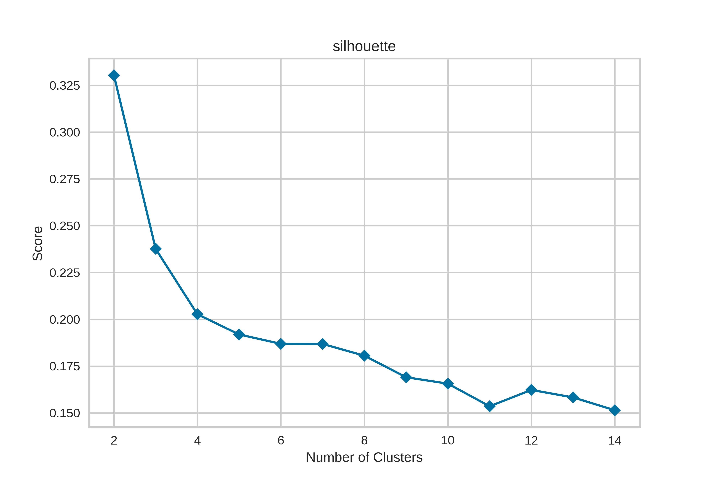
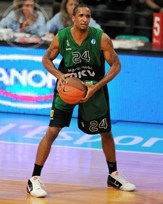

# ACB Players Clustering (10s decade) by PCA + KMeans

 

 ## Introduction

 The scope of this project is to classify ACB Basketball players of the 10s into different groups purely based their game stats and see how they cluster each other.

 ## Data Source

 The game stats of each player per season were scraped from the [ACB](http://www.acb.com/) official website.

 ## Features

 Player stats were redefined by a 20-min played unit since the purpose is to compare players regardless of how many minutes or games they played.

 Seasonal records with less than 5 minutes avg. or 10 games played were considered irrelevant and discarded.

 17 features were used: 

 * `points`: total points scored
 * `3p_try`: 3-point shots tried
 * `3p_perc`: 3-point shots conversion percentage 
 * `2p_try`: 2-point shots tried
 * `2p_perc`: 2-point shots conversion percentage
 * `free_try`: free-throws tried
 * `free_perc`: free-throws conversion percentage
 * `reb_def`: defensive rebounds
 * `reb_att`: attacking rebounds
 * `reb_tot`: total rebounds
 * `assis`: assists
 * `steals`: steals
 * `turnovers`: turnovers
 * `block_fav`: given blocks 
 * `block_con`: received blocks
 * `dunks`: dunks
 * `foults_rec`: received foults

The feature `commited foults` was discarded since it produced a lot of impact when clustering and from my point of view, it does not tell much whether a player has 2 foults or 3 foults on average and also in many last-minute situations, foults are forced on purpose by players.

## PCA for dimensionality reduction

Ok, so those 17 parameters features the players, but before applying clustering by Kmeans algorithm, a PCA pre-step is performed in order to mititage the [curse of dimensionality](https://en.wikipedia.org/wiki/Curse_of_dimensionality).

But how many PCs? Let's keep the PCs that can attain at least the 80% of the variance. In this case was the first 6.

 

 

The 1st PC retains 37% of total variance, the 2nd PC retains the 17%...

Let's see the Eigen vector of each PC and try to get insights of it.

 

And this is how I see them:

* **PC1**: Inside the Paint game
* **PC2**: Lack of contribution to the game
* **PC3**: Ball distribution and usage
* **PC4**: Bad choice shooter
* **PC5**: Steal capacity
* **PC6**: Penetration skill

Based on above, it seems the first quality to classify players is whether they usually play close or afar from basket.

## Kmeans Clustering

Ok, now in the new feature space, Kmeans clustering is applied. But again, how many number of cluster do we set?

By looking at the silhouette, distortion and calinski_harabasz scores, I finally ended up with **7** clusters.

## Results

### CLUSTER 0 - Great Court Vision and Assist Leaders

#### Centroid

| PC1   | PC2   | PC3   | PC4   | PC5   | PC6   |
|:------|:------|:------|:------|:------|:------|
| -2.23 | -0.7  | 1.48  | -0.53 | -0.05 | 0.22  |

#### Avg Stats

| points   | 3p_try   | 3p_perc   | 2p_try   | 2p_perc   | free_try   |
|:---------|:---------|:----------|:---------|:----------|:-----------|
| 6.34     | 2.59     | 30.88     | 2.95     | 45.11     | 1.53       |

| free_perc   | reb_def   | ref_att   | reb_tot   | assis   | steals   |
|:------------|:----------|:----------|:----------|:--------|:---------|
| 78.1        | 1.5       | 0.4       | 1.9       | 2.73    | 0.84     |

| turnovers   | block_fav   | block_con   | dunks   | foults_rec   |
|:------------|:------------|:------------|:--------|:-------------|
| 1.64        | 0.05        | 0.23        | 0.03    | 2.03         |

Players in this cluster have great court vision and easily find a teammate to assist. Their pass skills outstands above other aspects like scoring (high PC3). They mainly play outside the 3 point line (low PC1). 
Typically associated with the position of point guards. 

#### Players in this Cluster:

[Albert Oliver](http://www.acb.com/jugador/temporada-a-temporada/id/20200483)           |  [Facu Campazzo](http://www.acb.com/jugador/temporada-a-temporada/id/20211331) |  [Raül López](http://www.acb.com/jugador/temporada-a-temporada/id/20200628)
:-------------------------:|:-------------------------: |:-------------------------:
  |   | 

### CLUSTER 1 - Top Forwards

#### Centroid

| PC1   | PC2   | PC3   | PC4   | PC5   | PC6   |
|:------|:------|:------|:------|:------|:------|
| 3.63  | -1.57 | -0.05 | 0.18  | 0.13  | -0.32 |

#### Avg Stats

| points   | 3p_try   | 3p_perc   | 2p_try   | 2p_perc   | free_try   |
|:---------|:---------|:----------|:---------|:----------|:-----------|
| 9.39     | 0.65     | 18.24     | 6.14     | 54.8      | 2.97       |

| free_perc   | reb_def   | ref_att   | reb_tot   | assis   | steals   |
|:------------|:----------|:----------|:----------|:--------|:---------|
| 69.28       | 3.12      | 1.74      | 4.85      | 0.86    | 0.65     |

| turnovers   | block_fav   | block_con   | dunks   | foults_rec   |
|:------------|:------------|:------------|:--------|:-------------|
| 1.56        | 0.49        | 0.4         | 0.56    | 2.93         |

Players in this cluster play inside the paint (high PC1), with great skills to score (low PC2), get rebounds and occasionally if required are able to shoot and score 3 points. 

#### Players in this Cluster:

[Felipe Reyes](http://www.acb.com/jugador/temporada-a-temporada/id/20200355)           |  [Bojan Dubljevic](http://www.acb.com/jugador/temporada-a-temporada/id/20210254/tipo_id/1/competicion_id/1/fase_id/0#cuerpo) |  [Nikola Mirotic](http://www.acb.com/jugador/temporada-a-temporada/id/20202101)
:-------------------------:|:-------------------------: |:-------------------------:
  |   | 

### CLUSTER 2 - 3P Shooters

#### Centroid

| PC1   | PC2   | PC3   | PC4   | PC5   | PC6   |
|:------|:------|:------|:------|:------|:------|
| -2.17 | 0.96  | -1.21 | 0.08  | -0.21 | 0.08  |

#### Avg Stats

| points   | 3p_try   | 3p_perc   | 2p_try   | 2p_perc   | free_try   |
|:---------|:---------|:----------|:---------|:----------|:-----------|
| 7.79     | 3.82     | 37.28     | 2.63     | 49.17     | 1.14       |

| free_perc   | reb_def   | ref_att   | reb_tot   | assis   | steals   |
|:------------|:----------|:----------|:----------|:--------|:---------|
| 80.97       | 1.67      | 0.49      | 2.16      | 1.03    | 0.53     |

| turnovers   | block_fav   | block_con   | dunks   | foults_rec   |
|:------------|:------------|:------------|:--------|:-------------|
| 0.94        | 0.12        | 0.18        | 0.08    | 1.28         |

Specialist in 3P shots. They try more 3P shots than 2P and have high conversion percentage. They tend to be open, ready to receive the ball and shoot with low ball usage (low PC3, low PC1, high PC2).

#### Players in this Cluster:

[Brad Oleson](http://www.acb.com/jugador/temporada-a-temporada/id/20202105)           |  [Álex Abrines](http://www.acb.com/jugador/temporada-a-temporada/id/20209223) |  [Clay Tucker](http://www.acb.com/jugador/temporada-a-temporada/id/20200010)
:-------------------------:|:-------------------------: |:-------------------------:
  |   | 

### CLUSTER 3 - Hybrid Players

#### Centroid

| PC1   | PC2   | PC3   | PC4   | PC5   | PC6   |
|:------|:------|:------|:------|:------|:------|
| 0.57  | 0.46  | -0.58 | -0.12 | 0.52  | -0.2  |

#### Avg Stats

| points   | 3p_try   | 3p_perc   | 2p_try   | 2p_perc   | free_try   |
|:---------|:---------|:----------|:---------|:----------|:-----------|
| 7.61     | 2.11     | 32.65     | 4.06     | 51.78     | 1.72       |

| free_perc   | reb_def   | ref_att   | reb_tot   | assis   | steals   |
|:------------|:----------|:----------|:----------|:--------|:---------|
| 73.78       | 2.63      | 1.16      | 3.79      | 0.85    | 0.67     |

| turnovers   | block_fav   | block_con   | dunks   | foults_rec   |
|:------------|:------------|:------------|:--------|:-------------|
| 1.11        | 0.31        | 0.27        | 0.27    | 1.8          |

Versatile players who can play in the paint or outside with great percentages in all ranges (not very extreme PCs). 

#### Players in this Cluster:

[Andrés Nocioni](http://www.acb.com/jugador/temporada-a-temporada/id/20200453)           |  [Axel Hervelle](http://www.acb.com/jugador/temporada-a-temporada/id/20201748) |  [Jorge Garbajosa](http://www.acb.com/jugador/temporada-a-temporada/id/20200999)
:-------------------------:|:-------------------------: |:-------------------------:
  |   | 

### CLUSTER 4 - Top Outside Players

#### Centroid

| PC1   | PC2   | PC3   | PC4   | PC5   | PC6   |
|:------|:------|:------|:------|:------|:------|
| -1.29 | -2.17 | -0.39 | 0.25  | -0.2  | 0.09  |

#### Avg Stats

| points   | 3p_try   | 3p_perc   | 2p_try   | 2p_perc   | free_try   |
|:---------|:---------|:----------|:---------|:----------|:-----------|
| 9.7      | 3.45     | 35.14     | 4.22     | 48.32     | 2.36       |

| free_perc   | reb_def   | ref_att   | reb_tot   | assis   | steals   |
|:------------|:----------|:----------|:----------|:--------|:---------|
| 81.73       | 1.6       | 0.44      | 2.05      | 1.83    | 0.68     |

| turnovers   | block_fav   | block_con   | dunks   | foults_rec   |
|:------------|:------------|:------------|:--------|:-------------|
| 1.55        | 0.08        | 0.33        | 0.07    | 2.53         |

Outside players (low PC1) who can easily score and contribute to the team (low PC2). They assume the role to score in the team (PC4) along with the ones in the Cluster 1. Most likely is the go-to player in a clutch situation. 

#### Players in this Cluster:

[Luka Doncic](http://www.acb.com/jugador/temporada-a-temporada/id/20210121)           |  [Sergio Llull](http://www.acb.com/jugador/temporada-a-temporada/id/20201774) |  [Juan Carlos Navarro](http://www.acb.com/jugador/temporada-a-temporada/id/20200515)
:-------------------------:|:-------------------------: |:-------------------------:
  |   | 

